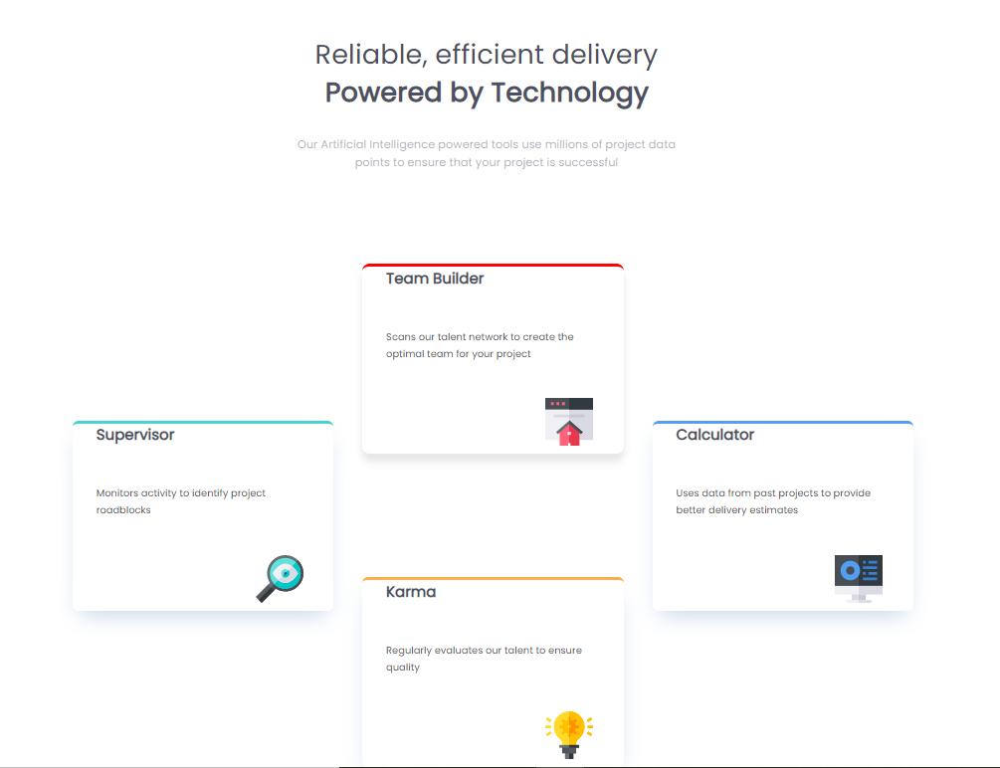

# Frontend Mentor - Four card feature section solution

This is a solution to the [Four card feature section challenge on Frontend Mentor](https://shawnpursley.github.io/Four-Card-Feature/). Frontend Mentor challenges help you improve your coding skills by building realistic projects.

## Table of contents

- [Overview](#overview)
  - [The challenge](#the-challenge)
  - [Screenshot](#screenshot)
  - [Links](#links)
- [My process](#my-process)
  - [Built with](#built-with)
  - [Useful resources](#useful-resources)
- [Author](#author)
- [Acknowledgments](#acknowledgments)
## Overview
A Four Card Feature built in desktop and mobile view. Will work on all devices regardless of the screen size.
### The challenge

Users should be able to:

- View the optimal layout for the site depending on their device's screen size

### Screenshot

### Links

- Solution URL: [Frontend Mentor-Four Card Feature Section](https://www.frontendmentor.io/solutions/four-card-feature-section-desktop-and-mobile-view-f4F-jNW2I)
- Live Site URL: [Four Card Feature](https://shawnpursley.github.io/Four-Card-Feature/)

## My process
I started out working on the desktop view and then after I got everything completed with the desktop view and tested both
on machine and on the web, I used the media query and did the mobile view and tested both.
### Built with

- Semantic HTML5 markup
- CSS3 custom properties
### Useful resources

- [W3Schools](https://www.w3schools.com/) - This site helped me with the whole entire project. Everything I put into this project
came from this website.

## Author

- Website - [Shawn E. Pursley](https://shawnpursley.github.io/Four-Card-Feature/)
- Frontend Mentor - [@shawnpursley](https://www.frontendmentor.io/profile/shawnpursley)

## Acknowledgments

I want to give a big shout out to Elijah Cravens (https://www.frontendmentor.io/profile/elijah80) for giving me the motivation to keep going to complete another project.
He has inspired me everyday through programming this project and my hat goes off to his expertise and friendship!!